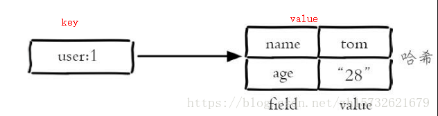
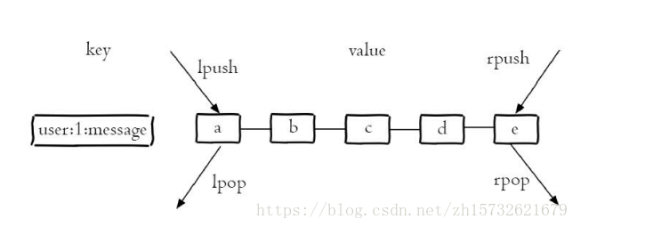
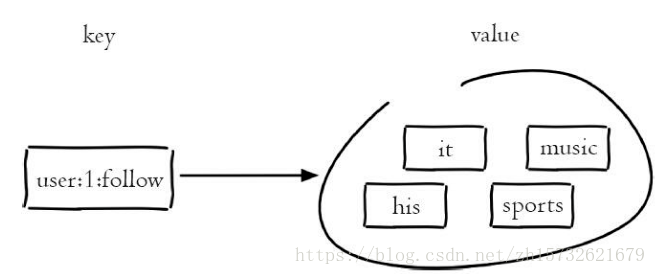
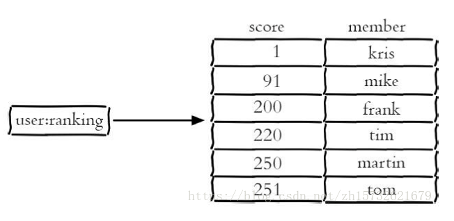

# 1.redis数据类型

redis有5大基本类型和3种特殊类型

5大基本数据类型：

1. <font color=red>String (字符串)</font>

   可以是字符串（简单的字符串、复杂的字符串（例如JSON、XML））、数字（整数、浮点数），甚至是二进制（图片、音频、视频），但是值最大不能超过512MB

2. <font color=red>hash</font>

   

   使用场景：存储用户信息

3. <font color=red>list</font>

   存储多个有序字符串

   

4. <font color=red>sets</font>

   

5. <font color=red>sorted sets</font>



3种特殊数据类型：

1. GEO (地理位置)
2. hyperLogLog (基数统计算法) -- 一种不精确的去重计数方案
3. bitmaps (位图) -- 打卡签到


# 2.redis设计

## 2.1 redis为什么快？

redis基于内存操作，单线程设计避免了上下文切换开销

## 2.2 redis持久化机制

redis的持久化机制有RDB和AOF两种。

redis是一个内存数据库，数据保存在内存中，内存的数据变化是很快的，也容易发生丢失。所以Redis提供了持久化的机制，分别是

RDB(Redis DataBase)和AOF(Append Only File)。

**一、RDB（redis默认持久化方式）** 

RDB其实就是把数据以快照的形式保存在磁盘上。

RDB持久化是指在指定的时间间隔内将内存中的数据集快照写入磁盘的二进制文件中，默认的文件名为dump.rdb。

在我们安装了redis之后，所有的配置都是在redis.conf文件中，里面保存了RDB和AOF两种持久化机制的各种配置。

既然RDB机制是通过把某个时刻的所有数据生成一个快照来保存，那么就应该有一种触发机制，是实现这个过程。对于RDB来说，提供了三种机制：save、bgsave、自动化。

**1、save触发方式**

该命令会阻塞当前Redis服务器，执行save命令期间，Redis不能处理其他命令，直到RDB过程完成为止。

执行完成时候如果存在老的RDB文件，就把新的替代掉旧的。我们的客户端可能都是几万或者是几十万，这种方式显然不可取。

**2、bgsave触发方式**

执行该命令时，Redis会在后台异步进行保存快照操作，同时还可以响应客户端请求。

具体操作是Redis进程执行fork操作创建子进程，RDB持久化过程由子进程负责，完成后自动结束。阻塞只发生在fork阶段，一般时间很短。基本上 Redis 内部所有的RDB操作都是采用 bgsave 命令。

**3、自动触发**

自动触发是由我们的配置文件来完成的。在redis.conf配置文件中，有如下配置：

**①save：**这里是用来配置触发 Redis的 RDB 持久化条件，也就是什么时候将内存中的数据保存到硬盘。比如“save m n”。表示m秒内数据集存在n次修改时，自动触发bgsave。

默认如下配置：

```properties
#表示900 秒内如果至少有 1 个 key 的值变化，则保存
save 900 1

#表示300 秒内如果至少有 10 个 key 的值变化，则保存
save 300 10

#表示60 秒内如果至少有 10000 个 key 的值变化，则保存
save 60 10000

#不需要持久化，那么你可以注释掉所有的 save 行来停用保存功能。
```

**②stop-writes-on-bgsave-error ：**默认值为yes。当启用了RDB且最后一次后台保存数据失败，Redis是否停止接收数据。这会让用户意识到数据没有正确持久化到磁盘上，否则没有人会注意到灾难（disaster）发生了。如果Redis重启了，那么又可以重新开始接收数据了

**③rdbcompression ；**默认值是yes。对于存储到磁盘中的快照，可以设置是否进行压缩存储。

**④rdbchecksum ：**默认值是yes。在存储快照后，我们还可以让redis使用CRC64算法来进行数据校验，但是这样做会增加大约10%的性能消耗，如果希望获取到最大的性能提升，可以关闭此功能。

**⑤dbfilename ：**设置快照的文件名，默认是 dump.rdb

**⑥dir：**设置快照文件的存放路径，这个配置项一定是个目录，而不能是文件名。

**4、RDB 的优势和劣势**

①、优势

（1）RDB文件紧凑，全量备份，非常适合用于进行备份和灾难恢复。

（2）生成RDB文件的时候，redis主进程会fork()一个子进程来处理所有保存工作，主进程不需要进行任何磁盘IO操作。

（3）RDB 在恢复大数据集时的速度比 AOF 的恢复速度要快。

②、劣势

RDB快照是一次全量备份，存储的是内存数据的二进制序列化形式，存储上非常紧凑。当进行快照持久化时，会开启一个子进程专门负责快照持久化，子进程会拥有父进程的内存数据，父进程修改内存子进程不会反应出来，所以在快照持久化期间修改的数据不会被保存，可能丢失数据。

**二、AOF机制**

全量备份总是耗时的，redis提供一种更加高效的方式AOF，工作机制很简单，redis会将每一个收到的写命令都通过write函数追加到文件中。通俗的理解就是日志记录。

**1、持久化原理**


每当有一个写命令过来时，就直接保存在我们的AOF文件中。

**2、文件重写原理**

AOF的方式也同时带来了另一个问题。持久化文件会变的越来越大。为了压缩aof的持久化文件。redis提供了bgrewriteaof命令。将内存中的数据以命令的方式保存到临时文件中，同时会fork出一条新进程来将文件重写。


重写aof文件的操作，并没有读取旧的aof文件，而是将整个内存中的数据库内容用命令的方式重写了一个新的aof文件，这点和快照有点类似。

**3、AOF也有三种触发机制**

（1）每修改同步always：同步持久化 每次发生数据变更会被立即记录到磁盘 性能较差但数据完整性比较好

（2）每秒同步everysec：异步操作，每秒记录 如果一秒内宕机，有数据丢失

（3）不同no：从不同步


**4、优点**

（1）AOF可以更好的保护数据不丢失，一般AOF会每隔1秒，通过一个后台线程执行一次fsync操作，最多丢失1秒钟的数据。

（2）AOF日志文件没有任何磁盘寻址的开销，写入性能非常高，文件不容易破损。

（3）AOF日志文件即使过大的时候，出现后台重写操作，也不会影响客户端的读写。

（4）AOF日志文件的命令通过非常可读的方式进行记录，这个特性非常适合做灾难性的误删除的紧急恢复。比如某人不小心用flushall命令清空了所有数据，只要这个时候后台rewrite还没有发生，那么就可以立即拷贝AOF文件，将最后一条flushall命令给删了，然后再将该AOF文件放回去，就可以通过恢复机制，自动恢复所有数据

**5、缺点**

（1）对于同一份数据来说，AOF日志文件通常比RDB数据快照文件更大

（2）AOF开启后，支持的写QPS会比RDB支持的写QPS低，因为AOF一般会配置成每秒fsync一次日志文件，当然，每秒一次fsync，性能也还是很高的

（3）以前AOF发生过bug，就是通过AOF记录的日志，进行数据恢复的时候，没有恢复一模一样的数据出来。

**四、RDB和AOF到底该如何选择**

选择的话，两者加一起才更好。根据实际的需求进行选择，但是通常都是结合使用。有一张图可供总结：


# 3.redis应用场景

## 3.1 redis缓存

<font color=red>缓存穿透：</font>

查询不存在的数据，缓存无法命中，请求全部打到数据库就叫缓存穿透。可以使用布隆过滤器解决。
布隆过滤器是一个很长的二进制向量和一系列随机映射函数。布隆过滤器可以用于检索一个元素是否在一个集合中。**它的优点是空间效率和查询时间都比一般的算法要好的多，缺点是有一定的误识别率（说存在不一样定存在，说不存在一定不存在）**

<font color=red>缓存击穿：</font>

某个key有着很大的访问量，在这个key失效的瞬间大量的访问打到了数据库上就叫缓存击穿。解决办法：1. 设置热点数据永不过期。2. 加互斥锁。

<font color=red>缓存雪崩：</font>

缓存雪崩是指在某个时间段，大量缓存过期失效，而查询数据量巨大，引起数据库压力过大甚至down机。

解决办法：1. 缓存数据的过期时间设置随机，防止同一时间大量数据过期现象发生。2. 设置热点数据永不过期。3. 若缓存是分布式，将热点数据均匀地分布在各台服务器上

## 3.2 redis实现分布式锁

分布式锁一般有三种实现方式：1. 数据库乐观锁；2. <font color=red>基于Redis的分布式锁</font>；3. 基于ZooKeeper的分布式锁

为了确保分布式锁可用，至少要确保锁的实现同时满足以下四个条件：

1. 互斥性。在任意时刻，只有一个客户端能持有锁。
2. 不会发生死锁。即使有一个客户端在持有锁的期间崩溃而没有主动解锁，也能保证后续其他客户端能加锁。
3. 具有容错性。只要大部分的Redis节点正常运行，客户端就可以加锁和解锁。
4. 解铃还须系铃人。加锁和解锁必须是同一个客户端，客户端自己不能把别人加的锁给解了。

```java
public class RedisTool {

    private static final String LOCK_SUCCESS = "OK";
    private static final String SET_IF_NOT_EXIST = "NX";
    private static final String SET_WITH_EXPIRE_TIME = "PX";

    /**
     * 尝试获取分布式锁
     * @param jedis Redis客户端
     * @param lockKey 锁
     * @param requestId 请求标识
     * @param expireTime 超期时间
     * @return 是否获取成功
     */
    public static boolean tryGetDistributedLock(Jedis jedis, String lockKey, String requestId, int expireTime) {

        String result = jedis.set(lockKey, requestId, SET_IF_NOT_EXIST, SET_WITH_EXPIRE_TIME, expireTime);

        if (LOCK_SUCCESS.equals(result)) {
            return true;
        }
        return false;

    }
}
```

可以看到，我们加锁就一行代码：`jedis.set(String key, String value, String nxxx, String expx, int time)`，这个set()方法一共有五个形参：

- 第一个为key，我们使用key来当锁，因为key是唯一的。
- 第二个为value，我们传的是requestId，很多童鞋可能不明白，有key作为锁不就够了吗，为什么还要用到value？原因就是我们在上面讲到可靠性时，分布式锁要满足第四个条件解铃还须系铃人，通过给value赋值为requestId，我们就知道这把锁是哪个请求加的了，在解锁的时候就可以有依据。requestId可以使用`UUID.randomUUID().toString()`方法生成。
- 第三个为nxxx，这个参数我们填的是NX，意思是SET IF NOT EXIST，即当key不存在时，我们进行set操作；若key已经存在，则不做任何操作；
- 第四个为expx，这个参数我们传的是PX，意思是我们要给这个key加一个过期的设置，具体时间由第五个参数决定。
- 第五个为time，与第四个参数相呼应，代表key的过期时间。

总的来说，执行上面的set()方法就只会导致两种结果：1. 当前没有锁（key不存在），那么就进行加锁操作，并对锁设置个有效期，同时value表示加锁的客户端。2. 已有锁存在，不做任何操作。

我们的加锁代码满足我们可靠性里描述的三个条件。首先，set()加入了NX参数，可以保证如果已有key存在，则函数不会调用成功，也就是只有一个客户端能持有锁，满足互斥性。其次，由于我们对锁设置了过期时间，即使锁的持有者后续发生崩溃而没有解锁，锁也会因为到了过期时间而自动解锁（即key被删除），不会发生死锁。最后，因为我们将value赋值为requestId，代表加锁的客户端请求标识，那么在客户端在解锁的时候就可以进行校验是否是同一个客户端。由于我们只考虑Redis单机部署的场景，所以容错性我们暂不考虑。

```java
public class RedisTool {

    private static final Long RELEASE_SUCCESS = 1L;

    /**
     * 释放分布式锁
     * @param jedis Redis客户端
     * @param lockKey 锁
     * @param requestId 请求标识
     * @return 是否释放成功
     */
    public static boolean releaseDistributedLock(Jedis jedis, String lockKey, String requestId) {

        String script = "if redis.call('get', KEYS[1]) == ARGV[1] then return redis.call('del', KEYS[1]) else return 0 end";
        Object result = jedis.eval(script, Collections.singletonList(lockKey), Collections.singletonList(requestId));

        if (RELEASE_SUCCESS.equals(result)) {
            return true;
        }
        return false;

    }

}
//可以看到，我们解锁只需要两行代码就搞定了！第一行代码，我们写了一个简单的Lua脚本代码，上一次见到这个编程语言还是在《黑客与画家》里，没想到这次居然用上了。第二行代码，我们将Lua代码传到jedis.eval()方法里，并使参数KEYS[1]赋值为lockKey，ARGV[1]赋值为requestId。eval()方法是将Lua代码交给Redis服务端执行。

//那么这段Lua代码的功能是什么呢？其实很简单，首先获取锁对应的value值，检查是否与requestId相等，如果相等则删除锁（解锁）。那么为什么要使用Lua语言来实现呢？因为要确保上述操作是原子性的。关于非原子性会带来什么问题，可以阅读【解锁代码-错误示例2】 。那么为什么执行eval()方法可以确保原子性，源于Redis的特性，下面是官网对eval命令的部分解释：

//简单来说，就是在eval命令执行Lua代码的时候，Lua代码将被当成一个命令去执行，并且直到eval命令执行完成，Redis才会执行其他命令。
```

redlock

# 4.redis最佳实践


